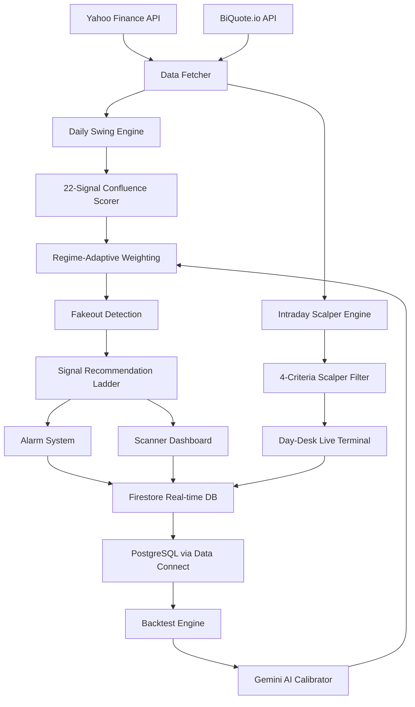
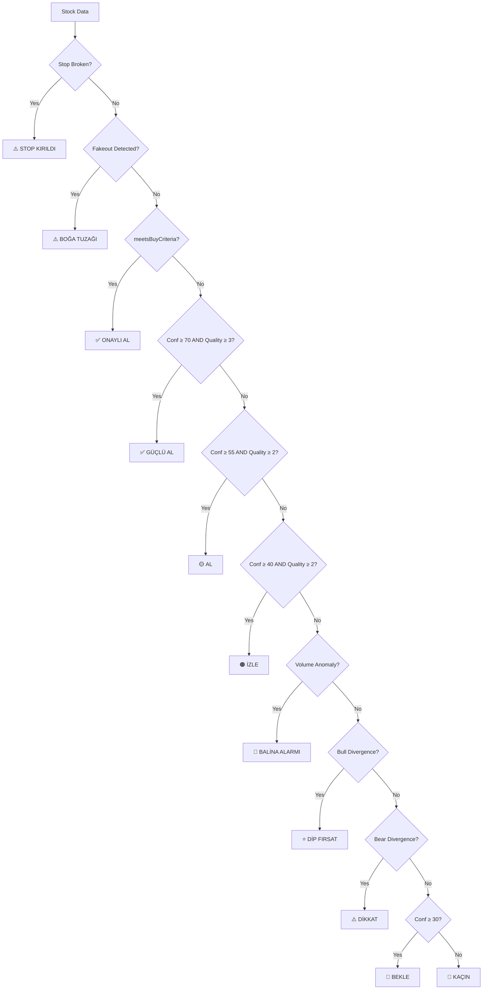
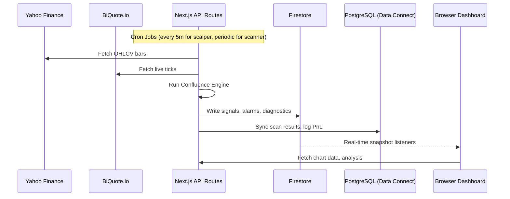
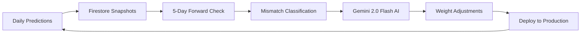

# 🏛️ Kazananlar Kulübü — Day Trading Algorithm Documentation
**Version:** 2.0 — Quantitative Multi-Engine System  
**Last Updated:** June 5, 2026  

---

## Table of Contents
1. [System Architecture](#1-system-architecture)
2. [Engine 1: Daily Swing Engine](#2-engine-1-daily-swing-engine)
3. [Engine 2: Intraday Scalper Engine](#3-engine-2-intraday-scalper-engine)
4. [Confluence Scoring System](#4-confluence-scoring-system)
5. [Signal Recommendation Ladder](#5-signal-recommendation-ladder)
6. [Risk Management](#6-risk-management)
7. [Data Pipeline & Infrastructure](#7-data-pipeline--infrastructure)
8. [Self-Calibration Loop](#8-self-calibration-loop)

---

## 1. System Architecture



### Dual-Engine Design

| Engine | Timeframe | Scope | Purpose |
|--------|-----------|-------|---------|
| **Daily Swing** | 1D bars (100 days) | 695+ BIST stocks | Medium-term directional signals |
| **Intraday Scalper** | 5m bars (5 days) | BIST 30 only | Ultra-short-term momentum plays |

Both engines are **LONG-only** — bearish conditions are flagged as warnings, not short signals.

---

## 2. Engine 1: Daily Swing Engine

### Data Sources
- **Price Data:** Yahoo Finance v8 API (OHLCV daily bars, 100-day window)
- **Live Tick:** BiQuote.io real-time last price injection
- **USD Conversion:** All calculations performed in USD (USDTRY rate applied)
- **Multi-Timeframe:** Daily, Hourly (24 bars), Weekly (100 bars), 2-Day aggregated, 3-Day aggregated

### Technical Indicators Computed

#### Trend Indicators
| Indicator | Parameters | Signal Logic |
|-----------|------------|--------------|
| EMA Cross | EMA(5) vs EMA(20) | Bullish when EMA5 > EMA20 |
| EMA Ribbon | EMA(5,10,20,50) alignment | Score 0-4: perfect alignment = 4 |
| Price vs EMA20 | — | Bullish when price > EMA20 |
| Ichimoku Cloud | (9, 26, 52) | Bullish when price > Span A & B, Tenkan > Kijun |
| Supertrend | ATR(10), multiplier=3 | UP/DOWN trend direction |
| Parabolic SAR | default | Bullish when SAR < price |
| EMA21 2-Day | 2-day aggregated bars | Price > 2-day EMA21 = bullish |
| EMA21 3-Day | 3-day aggregated bars | Price > 3-day EMA21 = bullish |
| Weekly EMA26 | Weekly bars | Major trend filter |

#### Momentum Indicators
| Indicator | Parameters | Signal Logic |
|-----------|------------|--------------|
| RSI | Period=14 | Bullish zone: 40-70 |
| MACD | (12, 26, 9) | Histogram > 0 and MACD > Signal |
| Stochastic | (14, 3, 3) | K > D and K < 80 |
| CCI | Period=20 | Positive: 0-200 range |
| RSI Divergence | 20-bar lookback | Bullish/Bearish divergence detection |
| MACD Divergence | 20-bar lookback | Bullish/Bearish divergence detection |

#### Volume & Money Flow Indicators
| Indicator | Parameters | Signal Logic |
|-----------|------------|--------------|
| CMF | Period=20 | Positive = institutional buying |
| OBV | — | Rising OBV confirms trend |
| VWAP | — | Price > VWAP = bullish |
| Volume Trend | 10-bar window | Confirmation ≥ 60% |
| A/D Line | — | Rising = accumulation |
| CLV | — | Close Location Value |

#### Structure & Volatility Indicators
| Indicator | Parameters | Signal Logic |
|-----------|------------|--------------|
| Bollinger Bands | (20, 2σ) | Bounce within bands; squeeze detection |
| ADX + DI | Period=14 | ADX > 25 with +DI > -DI = strong uptrend |
| Pivot Points | (5, 2) | Support/resistance level detection |
| Fibonacci | 2D & 3D aggregated | Extension targets at 1.618 |

#### Advanced Quantitative Modules
| Module | Purpose |
|--------|---------|
| **Kalman Filter** | Adaptive price smoothing (window=10, noise=0.05) |
| **HMM Regime Detection** | Classifies market as TREND / YATAY / KRİZ |
| **Kelly Criterion** | Fractional position sizing (2%-25% range, frozen in KRİZ) |

---

## 3. Engine 2: Intraday Scalper Engine

### Scope
Scans **BIST 30** stocks only (for liquidity) using **5-minute bars** from Yahoo Finance.

### Data Processing
1. Fetches 5-day range of 5m bars per symbol
2. Strips trailing zero-volume bars (incomplete candles)
3. Calculates VWAP from last ~100 bars (≈1 trading day)
4. Computes RVOL (relative volume vs 20-bar average)
5. Computes RSI(14) and RSI momentum (current - previous)

### LONG Signal Criteria (ALL must be true)

```
isApprovedLong = (
    price > VWAP              AND  // Trend direction UP
    RVOL > 2.0                AND  // Volume explosion (2x average)
    RSI < 75                  AND  // Not overbought
    RSI_momentum > 2               // RSI accelerating upward
)
```

### Scoring System
| Condition | Points |
|-----------|--------|
| RVOL > 2.5 | +40 (Volume Explosion) |
| RVOL > 1.5 | +20 (High Volume) |
| Price > VWAP | +30 (VWAP Trend) |
| RSI Momentum > 3 | +30 (Fast Momentum) |
| **Max possible** | **100** |

### Signal Output
Each signal includes: `symbol`, `price`, `rvol`, `vwapDev`, `rsiValue`, `rsiMomentum`, `direction`, `timestamp`, `reasons[]`, `score`

---

## 4. Confluence Scoring System

### Architecture
The confidence score is a **weighted percentage** of 22 binary signals, grouped into 4 categories:

```
confidence = (Σ active_signal_weights / Σ total_weights) × 100
```

### Signal Weight Table

#### Trend Category (~30% of total weight)
| Signal | Base Weight | Regime Boost |
|--------|-------------|-------------|
| EMA 5/20 Cross | 10 | ×1.3 in TRENDING |
| Price > EMA20 | 6 | ×1.3 in TRENDING |
| Ichimoku Bullish | 5 | ×1.3 in TRENDING |
| EMA Ribbon ≥ 2 | 4 | ×1.3 in TRENDING |
| EMA21 2-Day Bull | 10 | — |
| EMA21 3-Day Bull | 12 | — |

#### Momentum Category (~30%)
| Signal | Base Weight |
|--------|-------------|
| MACD Histogram > 0 | 7 |
| MACD > Signal | 4 |
| Stochastic K>D, K<80 | 5 |
| CCI 0-200 | 3 |
| RSI 40-70 | 4 |
| RSI Bull Divergence | 8 |
| MACD Bull Divergence | 6 |

#### Volume Category (~20%)
| Signal | Base Weight |
|--------|-------------|
| CMF20 > 0 | 8 |
| OBV Confirmation | 6 |
| Price > VWAP | 5 |
| Volume Trend ≥ 60% | 4 |

#### Structure Category (~20%)
| Signal | Base Weight | Regime Boost |
|--------|-------------|-------------|
| Supertrend UP | 5 | ×1.3 in TRENDING |
| SAR Bullish | 3 | — |
| ADX > 25 + DI+>DI- | 5 | ×1.3 in TRENDING |
| Bollinger Bounce | 5 | ×1.3 in RANGING |
| Bollinger Squeeze | 4 | ×1.3 in RANGING |
| Near Support | 4 | ×1.3 in RANGING |

### Penalties
| Condition | Penalty |
|-----------|---------|
| RSI Bearish Divergence | −15% |
| MACD Bearish Divergence | −10% |

### Signal Quality Score (0-4)
Each category is checked: if >40% of its signals are active, it "confirms."
- **4/4** = All categories confirm (Trend + Momentum + Volume + Structure)
- **3/4** = Strong confirmation
- **2/4** = Moderate
- **1/4** = Weak
- **0/4** = No confirmation

---

## 5. Signal Recommendation Ladder



### Detailed Signal Levels

| Level | Criteria | Action |
|-------|----------|--------|
| **✅ ONAYLI AL** | Trend≥60% AND Momentum≥60% AND Volume≥60%(50 trending) AND Weekly EMA26 OK AND No fakeout AND No stop broken | Full entry with stop loss |
| **✅ GÜÇLÜ AL** | Confluence ≥ 70%, Quality ≥ 3/4 | Strong entry with targets |
| **🟡 AL** | Confluence ≥ 55%, Quality ≥ 2/4 | Entry with caution |
| **🟠 İZLE** | Confluence ≥ 40%, Quality ≥ 2/4 | Watch for support entry |
| **🐳 BALİNA ALARMI** | Volume > 300% of 10-day average | Investigate unusual activity |
| **⭐ DİP FIRSAT** | RSI or MACD bullish divergence | Contrarian dip entry |
| **⚠️ DİKKAT** | RSI or MACD bearish divergence | Reduce exposure |
| **🔵 BEKLE** | Confluence ≥ 30% | Wait for better setup |
| **🔴 KAÇIN** | Confluence < 30% | No new positions |
| **⚠️ BOĞA TUZAĞI** | Fakeout detected | Avoid — false breakout |
| **⚠️ STOP KIRILDI** | Price < EMA21/EMA26 stop | Exit or recalculate |

### Fakeout Detection (Bull Trap)
The system checks 4 conditions:
1. **Low-Volume Pump:** Price rising + Volume confirm < 40% + CMF20 ≤ -0.05
2. **Bearish Divergence:** RSI or MACD divergence bearish
3. **Overextension:** Price ≥ Bollinger Upper + RSI ≥ 75 (non-trending only)
4. **Money Outflow:** CMF20 < -0.15 + OBV not rising

---

## 6. Risk Management

### Dynamic Stop Loss
```
initial_stop = min(EMA21, EMA26) × USDTRY

if price < initial_stop:
    stop_broken = true
    new_stop = max(support1, support2, price × 0.95) × 0.98
```

### Multi-Level Support (₺ TRY)
| Level | Calculation |
|-------|-------------|
| S1 | max(Pivot Support, EMA26) |
| S2 | Bollinger Lower Band |
| S3 | min(Ichimoku Span B, Ichimoku Kijun) |

### Multi-Level Targets ($ USD)
| Horizon | Method |
|---------|--------|
| Short-term | ATR-based momentum target |
| Medium-term | Fibonacci 1.618 extension |
| Long-term | Quantitative regression target |

### Position Sizing (Kelly Criterion)
```
kelly_fraction = f(win_rate_proxy, historical_returns)
regime_scale = {
    TREND: 1.0,
    YATAY: 0.7,
    KRİZ:  0.0  // Freeze all allocation
}
position_size = clamp(kelly × regime_scale, 2%, 25%)
```

### Risk/Reward Ratio
```
risk = max(price - support1, price × 0.01)  // min 1% risk
reward = (target2_usd × usdtry) - price
R/R = reward / risk
```

---

## 7. Data Pipeline & Infrastructure

### Real-time Data Flow


### Firestore Collections
| Collection | Purpose |
|------------|---------|
| `day_trade_live_signals` | Active scalper signals |
| `alarm_history` | Triggered scanner alarms |
| `system_status` | Scanner running state |
| `analysis_history` | Daily snapshot archive |
| `weekly_analysis_history` | Weekly snapshot archive |
| `system_config/indicator_weights` | AI-calibrated weights |
| `closed_positions` | PnL trade log |

### PostgreSQL Tables (via Data Connect)
| Table | Purpose |
|-------|---------|
| `Stock` | Core stock directory |
| `StockQuote` | Latest technical indicators |
| `ScanResult` | Confluence results |
| `AlarmHistory` | Triggered alarm log |
| `ClosedPosition` | Realized PnL records |
| `HistoricalKLine` | OHLCV archive |
| `BacktestResult` | Per-indicator backtest |
| `CalibrationIteration` | Walk-forward calibration |

### API Routes
| Route | Method | Purpose |
|-------|--------|---------|
| `/api/bist/[symbol]` | GET | Full analysis for symbol |
| `/api/bist/[symbol]/chart` | GET | Chart data with indicators |
| `/api/bist/scan` | GET | Full market scan |
| `/api/bist/background` | GET | Background scanner |
| `/api/bist/cron/scan` | GET | Cron: main scanner |
| `/api/bist/cron/scalper` | GET | Cron: 5m scalper |
| `/api/bist/cron/calibrate` | GET | Cron: AI calibration |
| `/api/bist/cron/smart-stop` | GET | Cron: dynamic stop update |
| `/api/bist/pnl` | GET/POST | PnL trade log |

---

## 8. Self-Calibration Loop

### Overview
The system includes a closed-loop calibration pipeline that continuously improves prediction accuracy:



### Mismatch Classification (T+5 Days)

| Classification | Condition |
|---------------|-----------|
| **TRUE_POSITIVE** | AL/GÜÇLÜ AL signal → price reached +3% target without hitting stop |
| **FALSE_POSITIVE** | AL/GÜÇLÜ AL signal → stop loss hit OR price dropped >3% |
| **FALSE_NEGATIVE** | KAÇIN/BEKLE signal → stock actually rose >5% |
| **IGNORED** | Signal level not actionable |

### Walk-Forward Calibration
- **Sliding Window:** Configurable train/validation periods
- **Pearson Correlation:** Between indicator activation and T+5/T+10/T+20 forward log returns
- **Weight Adjustment:** Correlation > 0.15 → +20%, Correlation < -0.05 → −20%
- **Deployment Gate:** Validation win rate must meet threshold before deploying

### Backtest Engine
- Tests 7 individual indicators: `emaCross`, `priceAboveEma20`, `macdHistogram`, `rsiBullishZone`, `cmfPositive`, `supertrendUp`, `bollingerSqueeze`
- Hold period: T+5 days
- Valid if: winRate ≥ 55% OR (winRate ≥ 50% AND profitFactor > 1.5)

---

## Appendix: Market Regime Detection

### Method 1: ADX + Bollinger Width
```typescript
if (adx > 25 && bbWidth > avgBbWidth * 1.2) → TRENDING
if (adx < 20 && bbWidth < avgBbWidth * 0.8) → RANGING
else → RANGING (default)
```

### Method 2: HMM (Hidden Markov Model)
- Uses 20-day rolling returns
- 3 states: TREND, YATAY (Sideways), KRİZ (Crisis)
- Confidence: probability of current state (0-100%)

### Regime Impact on Scoring
| Regime | Trend Signals | Structure Signals |
|--------|--------------|-------------------|
| TRENDING | ×1.3 boost | Normal |
| RANGING | Normal | ×1.3 boost |
| KRİZ | Normal | Normal + Kelly frozen |

---

*This document describes the complete algorithmic system as implemented in the codebase. All indicator calculations, scoring logic, and signal generation are deterministic and reproducible.*
