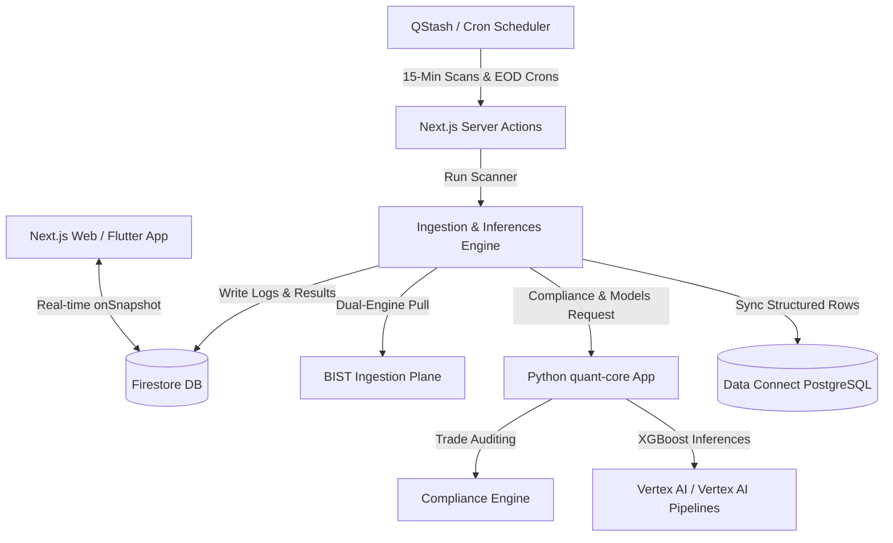

# BIST Analyst — Technical Architecture & Quantitative Scoring Guide

This document provides a detailed technical specification of the data ingestion pipelines, quantitative scoring algorithms, regime-adaptive weights, and decision-making logic used in the BIST Analyst system.

---

## 1. High-Level Architecture & Computation Planes

BIST Analyst is structured as a multi-tier serverless system built on Google Cloud and Firebase, combining a React/Next.js client interface with a Python-based quantitative FastAPI microservice.



---

## 2. The Ingestion Plane: Dual-Engine Data Pipeline

To resolve the 15-minute price delay standard on most Turkish market feeds, BIST Analyst runs a dual-engine fetch loop with three layers of fallback redundancy.

```
                    ┌────────────────────────┐
                    │ Data Request Initiated │
                    └───────────┬────────────┘
                                │
                                ▼
                   ┌──────────────────────────┐
                   │    BiQuote Bulk API      │
                   │ (Real-Time Tick Ingest)  │
                   └────────────┬─────────────┘
                                │
                    ┌───────────┴───────────┐
                    ▼                       ▼
            [Tick Valid]             [Tick Fails / Null]
                    │                       │
                    │                       ▼
                    │           ┌───────────────────────┐
                    │           │ Yahoo Spark API       │
                    │           │ (15m Delayed Ingest)  │
                    │           └───────────┬───────────┘
                    │                       │
                    │           ┌───────────┴───────────┐
                    │           ▼                       ▼
                    │     [Spark Valid]          [Spark Fails]
                    │           │                       │
                    │           │                       ▼
                    │           │           ┌───────────────────────┐
                    │           │           │  Twelve Data API      │
                    │           │           └───────────┬───────────┘
                    │           │                       │
                    │           │           ┌───────────┴───────────┐
                    │           │           ▼                       ▼
                    │           │      [TD Valid]              [TD Fails]
                    │           │           │                       │
                    │           │           │                       ▼
                    │           │           │           ┌───────────────────────┐
                    │           │           │           │ İş Yatırım Scraper    │
                    │           │           │           └───────────┬───────────┘
                    │           │           │                       │
                    │           │           │                       ▼
                    ▼           ▼           ▼                   [Success]
               ┌────────────────────────────────────────────────────┐
               │         Ingest raw data into analysis array        │
               └────────────────────────────────────────────────────┘
```

*   **Primary Live Engine (BiQuote API)**: Requests real-time ticks directly from Matriks/BiQuote feeds. If the payload doesn't contain a valid numeric `last` price, it returns `null`.
*   **Secondary Engine (Yahoo Finance Spark & Closes)**: Falls back to Yahoo Finance. Provides historical daily, weekly, and monthly bars, and handles spark checks.
*   **Layer 3 Fail-Safes**: If both primary engines fail, the system falls back sequentially to **Twelve Data**, the **İş Yatırım (Is Investment) historical public scraper**, and finally **BiQuote OHLC** candle aggregates.

---

## 3. Quantitative Scoring & Regime-Adaptive Algorithm

Each BIST stock is evaluated against **22 distinct technical parameters** grouped into 4 core categories: **Trend, Momentum, Volume, and Structure**.

### Market Regime Detection
Before analyzing indicators, the system detects the market regime using ADX and Bollinger Band Width volatility:
*   **TRENDING (ADX > 25 & BB Width > Average)**: High directional strength. The algorithm applies a **1.3x multiplier** to all Trend and Momentum indicator weights.
*   **RANGING (ADX <= 25 & BB Width <= Average)**: Low directional strength. The algorithm applies a **1.3x multiplier** to all Mean-Reversion and Structure indicators (RSI extremes, Bollinger Lower Band touches, Pivot Support levels).
*   **VOLATILE**: Triggers strict trailing-stop expansions based on ATR.

### Scoring Weights Matrix

The table below details the active parameters, their default relative weights, and the conditions under which they trigger:

| Category | Indicator Signal | Default Weight | Regime Adjustment | Trigger Condition |
| :--- | :--- | :---: | :--- | :--- |
| **Trend** | EMA Cross | 10 | 1.3x on Trending | `EMA 5 > EMA 20` |
| **Trend** | Price Above EMA 20 | 6 | 1.3x on Trending | `Last Close > EMA 20` |
| **Trend** | Ichimoku Bullish | 5 | 1.3x on Trending | `Price > Span A` & `Price > Span B` & `Tenkan > Kijun` |
| **Trend** | EMA Ribbon | 4 | 1.3x on Trending | EMA Ribbon index >= 2 (Bullish alignment) |
| **Trend** | 2-Day EMA 21 | 10 | - | `Last Close > 2-Day EMA 21` |
| **Trend** | 3-Day EMA 21 | 12 | - | `Last Close > 3-Day EMA 21` (High institutional weight) |
| **Momentum** | MACD Histogram | 7 | - | `MACD Histogram > 0` |
| **Momentum** | MACD Cross | 4 | - | `MACD > MACD Signal` |
| **Momentum** | Stochastic | 5 | - | `Stoch K > Stoch D` and `Stoch K < 80` |
| **Momentum** | CCI Positive | 3 | - | `CCI > 0` and `CCI < 200` |
| **Momentum** | RSI Bullish Zone | 4 | - | `RSI > 40` and `RSI < 70` |
| **Momentum** | RSI Bullish Divergence | 8 | - | Hidden/Regular bullish divergence detected |
| **Momentum** | MACD Bullish Divergence| 6 | - | MACD indicator divergence detected |
| **Volume** | CMF Positive | 8 | - | `Chaikin Money Flow (20) > 0` |
| **Volume** | OBV Confirmation | 6 | - | `OBV` is rising while price is stable or accumulating |
| **Volume** | VWAP Above | 5 | - | `Last Close > VWAP` (Institutional buyer premium) |
| **Volume** | Volume Trend | 4 | - | Current Volume > 1.5x of 10-day Average Volume |
| **Structure** | Supertrend | 5 | 1.3x on Trending | `Supertrend == UP` |
| **Structure** | Parabolic SAR | 3 | - | `SAR < Last Close` (Bullish SAR) |
| **Structure** | ADX Strength | 5 | 1.3x on Trending | `ADX > 25` and `+DI > -DI` |
| **Structure** | Bollinger Bounce | 5 | 1.3x on Ranging | `Last Close` bounces off the Lower Bollinger Band |
| **Structure** | Bollinger Squeeze | 4 | 1.3x on Ranging | Bands narrowing & `Last Close > BB SMA` |
| **Structure** | Near Pivot Support | 4 | 1.3x on Ranging | `Last Close` is within 2% of the nearest Pivot Support |

### Divergence Penalties (Critical Override)
To prevent buying near local tops or holding during bearish reversals, the system applies hard override penalties directly to the Confluence Score:
*   **RSI Bearish Divergence**: Deducts **-15 points** from the final score.
*   **MACD Bearish Divergence**: Deducts **-10 points** from the final score.

---

## 4. Decision-Making Matrix: "ONAYLI AL" Signals

For a stock to be flagged with the prestigious **ONAYLI AL** (Approved Buy) state, it must survive three strict operational filters:

```
                  ┌───────────────────────────────┐
                  │   Stock Analysis Completed    │
                  └───────────────┬───────────────┘
                                  │
                                  ▼
                     /─────────────────────────\
                    <   Confidence Score >= 60  >
                     \─────────────────────────/
                                  │ Yes
                                  ▼
                     /─────────────────────────\
                    <   Price > Weekly EMA 26   >
                     \─────────────────────────/
                                  │ Yes
                                  ▼
                     /─────────────────────────\
                    <    Signal Quality >= 3    >
                     \─────────────────────────/
                                  │ Yes
                                  ▼
                    ┌───────────────────────────┐
                    │  Trigger "ONAYLI AL"      │
                    │   (Visual Glowing Badge)  │
                    └───────────────────────────┘
```

1.  **Confidence Threshold**: The final Confluence Score must be **60 or greater** (out of 100).
2.  **Weekly EMA 26 Trend Filter**: The current price must be trading above the **Weekly EMA 26**. This prevents purchasing in long-term downtrends, filtering out fake daily breakouts.
3.  **Cross-Category Consensus (Signal Quality >= 3)**: Signal Quality represents the number of core categories (out of 4: Trend, Momentum, Volume, Structure) confirming the signal. We require **at least 3 categories** to agree.

---

## 5. Risk Management & Stop-Loss Engine

If a buy signal is generated, the risk engine calculates support, target, and trailing stop levels:
*   **ATR-Based Stop Loss**: Calculated as:
    $$\text{Stop Loss} = \text{Price} - (1.5 \times \text{ATR}_{14})$$
    This adapts the stop distance dynamically to the stock's recent volatility.
*   **Ribbon Guardrail**: The trailing stop is also bounded by the minimum of **EMA 21** and **EMA 26** in native currency.
*   **Fibonacci Targets**: Targets are calculated using 2-day and 3-day Fibonacci extension levels (1.618 ratio).

---

## 6. Automation Crons & Scheduler Pipeline

The system runs autonomously in the background via time-triggered schedules:
*   **15-Minute Scan Cron (`*/15 * * * 1-5`)**: Runs during market hours (Monday to Friday). It triggers a bulk scan, identifies volume spikes, breakouts, divergences, and pushes instant notifications.
*   **EOD Closing Summary (`15 18 * * 1-5`)**: Executes at market close (18:15). It compiles the day's top gainers, losers, active sectors, and support levels for the next trading day.
*   **Self-Auditing Autopsy (`15 18 * * 5`)**: Runs weekly. It audits past predictions against actual BigQuery OHLCV data to log forecast errors and trigger XGBoost model retraining via Vertex AI pipelines.
