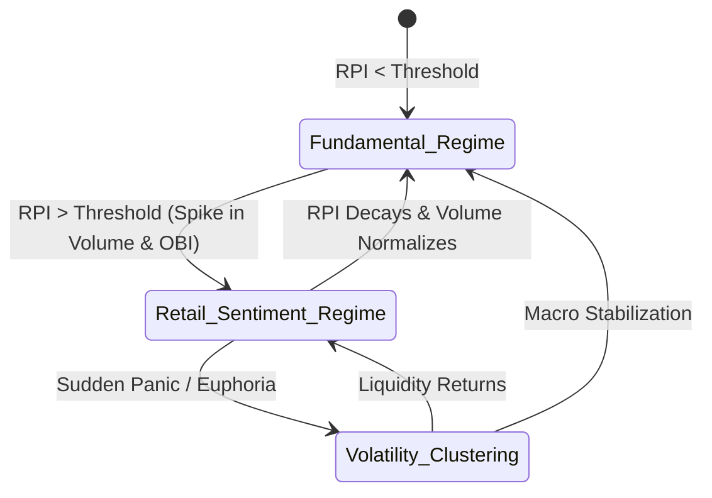

# BIST Psychological Microstructure & Adaptive Calibration Framework

Borsa İstanbul (BIST) operates under a psychological framework that diverges fundamentally from developed markets. Driven by a combination of macroeconomic defense mechanisms and extreme retail participation, it exhibits structural breaks and regime shifts that render conventional developed-market quantitative models highly vulnerable. 

This document outlines a rigorous, institutional-grade mathematical and algorithmic framework to adapt the **BIST Analyst** engine—including the **HMM Regime Detector**, **Adaptive Kalman Filter**, **Fractional Kelly Sizing Engine**, and **Calibration Engine**—to BIST's unique behavioral anomalies.

---

## 1. Structural Regime Transition Model

The primary structural break in BIST is the transition between a **Fundamental-Driven Regime** (institutional, valuation-sensitive) and a **Retail-Sentiment-Driven Regime** (momentum-ignited, noise-dominated). 

As highlighted in the empirical data:
> **Key insight:** The transition between a fundamental-driven regime and a retail-sentiment-driven regime usually coincides with sudden, extreme spikes in retail volume and order book imbalances.

### Mathematical Representation: Retail Participation Index ($RPI$)
To quantify this transition, we define a continuous indicator, the **Retail Participation Index** ($RPI_t$):

$$RPI_t = \alpha \cdot \frac{Vol_t}{SMA(Vol, N)_t} + \beta \cdot OBI_t + \gamma \cdot \zeta_t$$

Where:
*   $\frac{Vol_t}{SMA(Vol, N)_t}$: **Relative Volume (RVOL)**. A surge in daily volume relative to its $N$-day simple moving average (typically $N=20$) is the first marker of herd entry.
*   $OBI_t$: **Order Book Imbalance**. Defined using top-of-book bid-ask depth:
    $$OBI_t = \frac{|BidQty_t - AskQty_t|}{BidQty_t + AskQty_t}$$
*   $\zeta_t$: **Social Momentum / Saliency Factor**. Mentions, brokerage "most-active" appearances, or high-frequency retail brokerage buy/sell ratio (e.g., Mid-Cap retail flows via specific brokers).
*   $\alpha, \beta, \gamma$: Calibrated scaling weights satisfying $\alpha + \beta + \gamma = 1$.



---

## 2. Behavioral Adaptations for the Quant Engine

### A. Adaptive Kalman Filter Calibration ($Q$-Scaling)
In developed markets, the Kalman process noise covariance ($Q$) is kept stable. In BIST's "Hyper-Retail" microstructure, extreme trend-following herds create violent price spikes followed by severe order book imbalances.
*   **The Problem:** High retail noise triggers false trading signals or over-reactivity in normal Kalman filters.
*   **The Adaptation:** We dynamically scale the Kalman Filter process noise covariance ($Q$) by the $RPI$:

$$Q_t = Q_0 \cdot (1 + \lambda \cdot RPI_t)$$

> [!TIP]
> **Noise Dampening Mechanism:** When $RPI_t$ is low, $Q_t \approx Q_0$, making the Kalman Filter highly responsive to price movements (assuming they represent structural, fundamental pricing). When $RPI_t$ spikes, $Q_t$ increases, dampening the filter and forcing it to treat the sudden price spikes as high-frequency retail noise rather than a structural trend.

---

### B. Inflation-Hedge Valuation Discounting ("Parking Lot" Effect)
BIST is frequently treated as a "parking lot" to protect purchasing power against extreme currency depreciation (USD/TRY) and high CPI inflation.
*   **The Problem:** Traditional fundamental metrics like P/E, PEG, or DCF models completely detach from price action. Bad macro news triggers a rouble-like nominal rally as local capital flees currency depreciation into hard equities.
*   **The Adaptation:** The **Calibration Engine** must dynamically discount fundamental valuation weights in the confluence score during high inflation regimes:

$$Weight_{Fundamentals} = Weight_0 \cdot \exp\left(-\psi \cdot \Delta Inflation_t\right)$$

$$Weight_{Momentum} = 1 - Weight_{Fundamentals}$$

| Macro Regime | CPI YoY Rate | Fundamental Weight | Momentum & Trend Weight | Valuation Bias |
| :--- | :--- | :--- | :--- | :--- |
| **Normal / Developed** | $<10\%$ | $40\%$ | $60\%$ | Standard DCF & P/E apply |
| **High Inflation** | $10\% - 45\%$ | $15\%$ | $85\%$ | Valuation metrics decoupled; trend-following dominates |
| **Hyper-Inflationary** | $>45\%$ | $5\%$ | $95\%$ | "Parking Lot" active; assets priced in nominal hedge value |

---

### C. Extreme Disposition Bias Modeling
BIST retail investors exhibit an intense disposition bias—locking in gains prematurely but holding losing positions indefinitely.

```
       ┌────────────────────────────────────────────────────────┐
       │             BIST Retail Disposition Bias               │
       └───────────────────────────┬────────────────────────────┘
                                   │
         ┌─────────────────────────┴─────────────────────────┐
         ▼                                                   ▼
┌─────────────────────────────────┐        ┌─────────────────────────────────┐
│     Upward Rallies (Winners)    │        │    Downward Trends (Losers)     │
├─────────────────────────────────┤        ├─────────────────────────────────┤
│ * Retail sells too early.       │        │ * Retail refuses to capitulate. │
│ * Heavy friction near peaks.    │        │ * Margin calls drag indefinitely│
│ * Result: Tighten targets (TP)  │        │ * Result: Accelerate exits      │
└─────────────────────────────────┘        └─────────────────────────────────┘
```

*   **The Problem:** This bias creates friction bands in uptrends (as retail floods the book with profit-taking orders near resistance levels) and prolonged, dragging capitulations in downtrends (as retail holds bags, preventing healthy mean-reversion).
*   **The Adaptations:**
    1.  **Profit-Target Clamping (Uptrend Friction):**
        During high $RPI$ regimes, the Fibonacci-based target prices (TP1, TP2) are compressed by a factor of $0.85$ to capture the optimal exit window before retail profit-taking clusters ignite a micro-reversal.
    2.  **Accelerated Exit Trigger (Downtrend Drag):**
        The system reduces the stop-loss breathing room. Instead of a standard ATR multiplier of $2.0 \times ATR$, the stop-loss is tightened to $1.4 \times ATR$ in downtrends when retail dominance is high, preventing the system from getting dragged down by retail's refusal to capitulate.

---

### D. Attention-Driven (Saliency) Risk Caps
Capital flows heavily into stocks on brokerage "most active" or "highest volume" lists due to FOMO.
*   **The Problem:** Saliency feedback loops trigger explosive moves in low-float equities, followed by extreme crashes once the herd's attention rotates.
*   **The Adaptation:** Position sizing must be strictly managed using the **Fractional Kelly Sizing Engine**. When a symbol's saliency index ($SI$) crosses a critical threshold, the allocation is clamped:

$$Kelly_{Final} = \min\left(Kelly_{Calculated}, \frac{1}{8} \cdot Kelly_{Max}\right)$$

> [!WARNING]
> While high saliency creates strong momentum signals, the probability of a structural regime break (momentum exhaustion) rises exponentially. Clamping the allocation to a **1/8 fractional Kelly** protects the portfolio's core capital against sudden, thick-tailed retail liquidations.

---

## 3. Implementation Blueprint in BIST Analyst

To embed this psychological framework, we propose three core modifications to the codebase:

### Phase A: Upgrading `regime.ts` to Detect "Hyper-Retail" State
We will update `detectMarketRegime()` to return a `retailInfluence` score by incorporating relative volume (RVOL) and volatility clustering coefficients:

```typescript
// Proposed src/lib/quant/regime.ts addition
export interface ExtendedRegimeResult extends RegimeResult {
  retailInfluence: number; // Scale of 0.0 to 1.0
  isParkingLotActive: boolean; // Macro inflation defense active
}
```

### Phase B: Calibration Engine Recalibration Prompts (`calibrationEngine.ts`)
The prompt sent to the Gemini model in the daily calibration cycle will be enriched with macro indicators (e.g., USD/TRY volatility and CPI trends) so that the AI model can automatically de-weight valuation-based indicators in favor of capital flow volume during macro defense regimes.

### Phase C: UI Indicators & Stress Warnings
*   **Saliency Badge:** Symbols with extreme RVOL are badged as `HERD MOMENTUM` or `FOMO BURST` on the Next.js `BistScanner` cards.
*   **Parking Lot Mode Callout:** A dashboard-wide header banner is displayed when BIST enters "Inflation-Hedge Psychology" mode, alerting traders that P/E and other standard value ratios are currently detached from market mechanics.

---

### Summary of Algorithmic Tuning Rules

| Psychological Driver | Observable Signal | System Response | Target Metric |
| :--- | :--- | :--- | :--- |
| **Herd Effect** | RVOL $> 3.5$ & OBI $> 0.7$ | Increase Kalman process covariance $Q$ by $2\times$. | Filter out high-frequency social media noise. |
| **Inflation Hedge** | USD/TRY $> EMA(20)$ & CPI $> 40\%$ | Decrease Fundamental weighting in Confluence Score to $<10\%$. | Focus exclusively on momentum and volume inflows. |
| **Disposition Bias** | High retail volume on breakout | Compress TP1 target multiplier to $0.85\times$. | Exit ahead of retail profit-taking clusters. |
| **Downtrend Drag** | Negative momentum & high retail count | Tighten Stop-Loss multiplier from $2.0\times ATR$ to $1.4\times ATR$. | Prevent long, non-capitulating retail drawdowns. |
| **Attention FOMO** | Broker "Most Active" appearance | Clamp Kelly sizing to $1/8$ fractional limit. | Protect capital against sudden herd rotation. |
