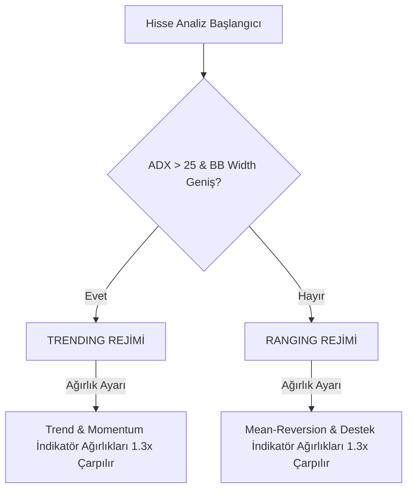

# BIST Analyst — Kantitatif Puanlama ve Sinyal Doğrulama Kılavuzu

Bu doküman, BIST Analyst platformunda hisse senetlerinin nasıl analiz edildiğini, hangi indikatörlerin hangi ağırlıklarla Confluence (Kesişim) Skorunu oluşturduğunu ve piyasa koşullarına göre bu katsayıların nasıl kalibre edildiğini detaylandırmaktadır.

---

## 1. Piyasa Rejimi Tespiti (Market Regime Detection)

Hisselerin teknik analiz parametreleri değerlendirilmeden önce, sistem BIST 100 endeksinin ve ilgili hissenin içinde bulunduğu piyasa rejimini belirler. Bu rejim tespiti için **ADX (Average Directional Index)** ve **Bollinger Bant Genişliği (Volatility)** kullanılır.

*   **TRENDING (Trend Piyasası)**: ADX > 25 ve volatilite yüksekse piyasada güçlü yönlü hareket var demektir. Bu durumda trend izleyen indikatörlerin güvenirliği artar ve ağırlıkları **1.3x** ile çarpılır.
*   **RANGING (Yatay/Kanal Piyasası)**: ADX <= 25 ise piyasa yatay bantta hareket ediyor demektir. Bu durumda desteklerden dönüşler ve aşırı alım/satım göstergelerinin ağırlıkları **1.3x** ile çarpılır.

---

## 2. Puanlama Matrisi (22 Parametrelik Confluence Modeli)

Her bir hisse senedi **22 teknik parametre** üzerinden analiz edilerek **0 ile 100 arasında** bir nihai Confluence Skoru alır. Varsayılan ağırlıklar ve rejim katsayıları aşağıdaki tabloda belirtilmiştir:

| Kategori | Gösterge Sinyali | Varsayılan Ağırlık | Rejim Ayarı | Tetiklenme Koşulu |
| :--- | :--- | :---: | :--- | :--- |
| **Trend** | EMA Kesişimi | **10** | Trend Piyasasında 1.3x | `EMA 5 > EMA 20` (Boğa eğilimi) |
| **Trend** | Fiyat > EMA 20 | **6** | Trend Piyasasında 1.3x | `Kapanış Fiyatı > EMA 20` |
| **Trend** | Ichimoku Bulutu | **5** | Trend Piyasasında 1.3x | `Fiyat > Senkou Span A & B` ve `Tenkan > Kijun` |
| **Trend** | EMA Ribbon Hizalanması | **4** | Trend Piyasasında 1.3x | En az 3 kısa vadeli EMA'nın boğa diziliminde olması |
| **Trend** | 2-Günlük EMA 21 | **10** | - | `Kapanış Fiyatı > 2-Günlük EMA 21` |
| **Trend** | 3-Günlük EMA 21 | **12** | - | `Kapanış Fiyatı > 3-Günlük EMA 21` (Kurumsal Destek) |
| **Momentum** | MACD Histogram | **7** | - | `MACD Histogramı > 0` |
| **Momentum** | MACD Kesişimi | **4** | - | `MACD Hattı > Sinyal Hattı` |
| **Momentum** | Stochastic Osc. | **5** | - | `Stoch K > D` ve `Stoch K < 80` (Aşırı alım dışı) |
| **Momentum** | CCI Pozitif | **3** | - | `CCI > 0` ve `CCI < 200` |
| **Momentum** | RSI Boğa Bölgesi | **4** | - | `RSI > 40` ve `RSI < 70` |
| **Momentum** | RSI Boğa Uyumsuzluğu | **8** | - | Fiyat düşerken RSI'ın yükselmesi (Divergence) |
| **Momentum** | MACD Boğa Uyumsuzluğu | **6** | - | MACD çizgilerinde pozitif uyumsuzluk tespiti |
| **Hacim** | CMF Pozitif (20) | **8** | - | `Chaikin Money Flow > 0` (Para Girişi) |
| **Hacim** | OBV Yükselişi | **6** | - | `OBV` çizgisinin yukarı yönlü ivmelenmesi |
| **Hacim** | VWAP Üzerinde Kapanış | **5** | - | `Fiyat > VWAP` (Kurumsal alıcı maliyetinin üstü) |
| **Hacim** | Hacim Trendi | **4** | - | Günlük hacmin 10 günlük ortalama hacmin 1.5 katını aşması |
| **Yapı** | Supertrend AL | **5** | Trend Piyasasında 1.3x | `Supertrend == UP` |
| **Yapı** | Parabolic SAR AL | **3** | - | `SAR Noktası < Kapanış Fiyatı` |
| **Yapı** | ADX Gücü | **5** | Trend Piyasasında 1.3x | `ADX > 25` ve `+DI > -DI` |
| **Yapı** | Bollinger Bandından Sekme | **5** | Yatay Piyasada 1.3x | Alt Bollinger bandına dokunup yukarı yönlü dönüş |
| **Yapı** | Bollinger Sıkışması | **4** | Yatay Piyasada 1.3x | Bantların daralması sonrası yukarı yönlü kopma |
| **Yapı** | Destek Seviyesine Yakınlık | **4** | Yatay Piyasada 1.3x | Fiyatın en yakın Pivot desteğine %2 veya daha yakın olması |

> [!CAUTION]
> ### Kritik Aykırılık Cezaları (Divergence Override)
> Hisselerin zirve bölgelerde tuzağa düşmesini engellemek için, sistem aşağıdaki ayı uyumsuzlukları durumunda nihai Confluence Skorundan doğrudan eksiltme yapar:
> *   **RSI Ayı Uyumsuzluğu (Bearish Divergence)**: Skordan **-15 puan** düşürür.
> *   **MACD Ayı Uyumsuzluğu (Bearish Divergence)**: Skordan **-10 puan** düşürür.

---

## 3. "ONAYLI AL" Karar Mekanizması

Tarayıcıda veya radarda bir hissenin **ONAYLI AL** (yeşil parlayan etiket) olarak etiketlenmesi için 3 filtreden de başarıyla geçmesi zorunludur:

1.  **Güven Skoru Filtresi**: Confluence skorunun **60 veya daha fazla** olması.
2.  **Haftalık EMA 26 Filtresi**: Fiyatın haftalık EMA 26 seviyesinin üzerinde olması. Bu filtre, düşüş trendindeki hisselerin günlük sahte kırılımlarını (Dead Cat Bounce) eler.
3.  **Çoklu Kategori Mutabakatı (Signal Quality >= 3)**: Alım sinyalinin 4 ana kategorinin (Trend, Momentum, Hacim, Yapı) en az **3'ü** tarafından onaylanması gerekir.

---

## 4. Risk Yönetimi ve Dinamik Stop-Loss

Sinyal onaylandığı anda risk motoru stop-loss ve hedef seviyelerini şu formüllerle belirler:

*   **ATR Tabanlı Stop-Loss (Dinamik Risk)**:
    $$\text{Stop-Loss} = \text{Fiyat} - (1.5 \times \text{ATR}_{14})$$
    Hissenin kendi oynaklığına göre stop seviyesini genişletir veya daraltır.
*   **Ribbon Koruması**: Stop seviyesi, hissenin günlük grafikteki **EMA 21** veya **EMA 26** seviyesinin altına sarktığında otomatik olarak güncellenir.
*   **Fibonacci Hedefleri**: Kar hedefleri (Take-Profit), 2 günlük ve 3 günlük Fibonacci uzatma seviyeleri (1.618 oranı) temel alınarak belirlenir.
