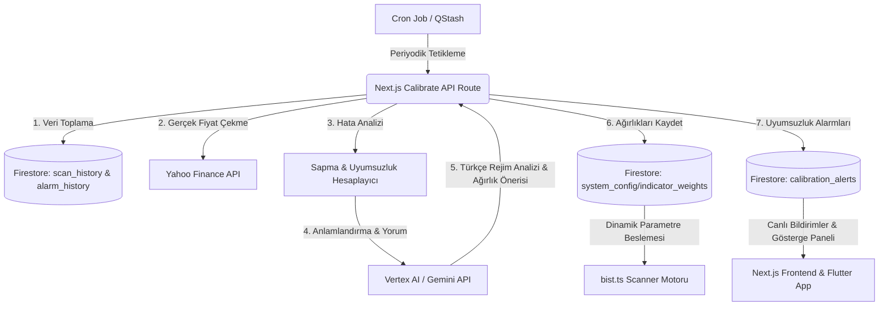

# BIST Analiz Sapma & Adaptif Kalibrasyon Motoru (Calibration Engine) Planı

Bu tasarım belgesi, sistemin geçmişte ürettiği teknik analiz kararlarını (ör. "Onaylı AL", "Boğa Tuzağı") periyodik olarak gerçek piyasa sonuçlarıyla geriye dönük test eden (backtest), sinyal uyumsuzluklarını (mismatches/drift) saptayan ve gösterge ağırlıklarını dinamik olarak yeniden kalibre eden bir **Adaptif Karar Destek ve Geri Besleme Sistemi** tasarımıdır.

---

## 1. Temel Problem ve İhtiyaç
Algoritmik tarayıcılar (Scanner) sabit gösterge ağırlıkları kullandığında, değişen piyasa rejimlerine (ör. boğa piyasasından yatay konsolidasyon veya ayı piyasasına geçiş) uyum sağlayamazlar:
- **Yatay Rejimde (Ranging)**: Trend takip göstergeleri (EMA Cross, Supertrend) çok sık sahte kırılım (Boğa Tuzağı - False Positive) üretir.
- **Trend Rejiminde (Trending)**: Osilatörler (RSI, Stochastic) aşırı alım bölgesinde sürekli "doyum/tuzak" uyarısı vererek güçlü yükseliş rallilerinin kaçırılmasına (False Negative) yol açar.

**Çözüm**: Sistem geçmişte yaptığı tahminlerin (verdict) $N$ gün sonraki performansını ölçmeli, hangi indikatörün en çok hata ürettiğini (error attribution) saptamalı ve **gösterge ağırlıklarını otomatik olarak ayarlamalı (Dynamic Weight Calibration)**, arayüze ve Flutter mobil paneline sapma uyarıları beslemelidir.

---

## 2. Sistem Mimarisi & Veri Akışı



---

## 3. Geçmiş Analizlerin Optimize Edilmiş Kataloglanması ve Depolanması

Sapma motorunun doğru çalışabilmesi için geçmiş analiz sonuçlarının eksiksiz kataloglanması ve depolanması kritik önem taşır. Ancak BIST'teki 611 hisse için gün içi yapılan tüm taramaların Firestore'a kaydedilmesi durumunda günlük yazma limiti (ücretsiz limit: 20.000 adet) çok hızlı tükenecektir.

Bu maliyet engelini tamamen sıfırlamak ve sistemi 100% ücretsiz sınırda tutmak amacıyla iki aşamalı bir **Akıllı Kataloglama & Depolama** stratejisi uygulanacaktır:

### A. Benzersiz Günlük İndeksleme (Birleştirilmiş Kayıt)
*   Her hissenin günlük tarama snapshot'ı Firestore üzerinde tek bir dokümanda birleştirilir.
*   Doküman ID yapısı: `analysis_history/{SYMBOL}_{YYYY-MM-DD}` (Örn: `THYAO_2026-06-01`).
*   **Avantaj**: Aynı gün içinde arka plan tarayıcı 12 kez çalışsa dahi, her hisse için günde sadece 1 yazma işlemi gerçekleşir. 611 hissenin tamamı için günlük maksimum Firestore yazma maliyeti sadece **611 adet** ile sınırlandırılır.

### B. Koşullu Değer Eşikli Kataloglama (Filtreleme)
*   Sadece karar değeri `İZLE`, `ZAYIF` veya `KAÇIN` dışındaki anlamlı sinyallerden biri olan (yani `ONAYLI AL`, `AL`, `BOĞA TUZAĞI`, `BALİNA ALARMI`, `DİP FIRSAT`, `DİKKAT`) hisselerin günlük geçmiş dokümanları arşivlenir.
*   **Avantaj**: Günlük depolama hacmi %70 oranında azaltılarak Firestore read/write operasyonları tamamen optimize edilir ve geriye dönük doğruluk analizine sadece katma değerli tahminler dahil edilir.

---

## 4. Veri Yapısı ve Koleksiyon Tasarımı (Firestore)

### A. Geçmiş Analiz Snapshot Kaydı (`analysis_history`)
Her gün son taraması yapıldığında, hissenin o anki teknik durumunun günlük kopyası kataloglanır:
```json
{
  "symbol": "THYAO",
  "timestamp": 1780303249000,
  "dateString": "2026-06-01",
  "priceAtAnalysis": 315.50,
  "verdict": "ONAYLI AL",
  "confluenceScore": 82,
  "stopLoss": 305.20,
  "targetPrice": 345.00,
  "activeSignals": {
    "emaCross": true,
    "rsiBullDiv": false,
    "cmfPositive": true,
    "bollSqueeze": true,
    "supertrendUp": true
  }
}
```

### B. Uyumsuzluk & Performans Raporları (`analysis_mismatches`)
Değerlendirme sonucunda tespit edilen hatalı veya başarılı kararlar loglanır:
```json
{
  "predictionId": "THYAO_1780303249000",
  "symbol": "THYAO",
  "evaluatedAt": "2026-06-01T13:00:00Z",
  "verdict": "ONAYLI AL",
  "priceAtAnalysis": 315.50,
  "actualPrice": 298.00,
  "maxPriceReached": 318.00,
  "minPriceReached": 296.00,
  "priceReturn": -5.55,
  "outcome": "FALSE_POSITIVE",
  "errorReason": "Stop Loss ihlal edildi, kırılım başarısız oldu.",
  "failedIndicators": ["bollSqueeze", "emaCross"]
}
```

### C. Kalibrasyon Uyarıları ve Rejim Mesajları (`calibration_alerts`)
Arayüzde ve mobil uygulamada gösterilecek canlı rejim ve düzeltme uyarıları:
```json
{
  "alertId": "calib_1780305600000",
  "createdAt": "2026-06-01T13:05:00Z",
  "marketRegime": "yatay_konsolidasyon",
  "accuracy30Day": 58.4,
  "commentary": "⚠️ PİYASA UYARISI: Son 7 günde BIST 100 yatay kanala girdiği için Bollinger Squeeze kırılım indikatörleri %42 oranında hatalı sinyal vermiştir. Sistem hassasiyeti artırılarak kırılım ağırlıkları düşürülmüş, destek alım parametreleri güçlendirilmiştir.",
  "adjustments": {
    "bollSqueeze": -4,
    "nearSupport": +3,
    "emaCross": -2
  }
}
```

---

## 5. Önerilen Değişiklikler ve Yeni Modüller

### A. [NEW] `calibrationEngine.ts`
* **İşlev**: Firestore `alarm_history` veya `analysis_history` koleksiyonunu sorgular.
* **Yahoo Finance Entegrasyonu**: Belirlenen gün aralığındaki (örn: 5 gün önceki) hisse fiyatlarını çeker.
* **Hata Atıf Analitiği**: Hangi teknik indikatörlerin aktif olduğu durumda tahminlerin başarısız olduğunu istatistiksel olarak hesaplar.
* **Gemini Entegrasyonu**: İstatistiksel hata matrisini Gemini'ye göndererek, pazar rejimini Türkçe yorumlayan ve parametre ayarlayan yapay zeka çıktısını alır.

### B. [NEW] `route.ts`
* **İşlev**: `/api/bist/cron/calibrate` uç noktası.
* **Tetikleyici**: Haftalık QStash veya Google Cloud Scheduler cron tetikleyicisi.
* **Güvenlik**: QStash imza doğrulaması ile dışarıdan yetkisiz tetiklemeleri engeller.

### C. [NEW] `CalibrationPanel.tsx`
* **Tasarım**: Premium, yarı saydam cam (glassmorphism) efektli, katlanabilir yapay zeka kalibrasyon paneli.
* **İçerik**: Modelin son 30 günlük başarı oranını, pazar rejimi uyarısını ve anlık olarak kalibre edilen gösterge ağırlık değişimlerini gösterir.

### D. [NEW] `calibration_panel.dart`
* **İşlev**: Flutter uygulamasında gerçek Firestore kalibrasyon verilerini anlık okuyacak REST/Firestore servis entegrasyonu tasarımı.

---

## 6. Gelişmiş Kantitatif İlave Modüller (Advanced Extensions)

### A. Sektör & Endeks Korelasyon Süzgeci
* **Açıklama**: Hisselerin teknik sinyalleri genel piyasa (XU100) ve bağlı oldukları sektör endekslerinin trend yönüyle hizalanmalıdır.
* **İşleyiş**: Günlük katalog kaydına endeksin o anki trend durumu (`XU100_Regime: BULL|BEAR|RANGE`) eklenir. Sapma motoru başarısız tahminleri incelerken, hatanın hisseden mi yoksa "sistemik drag" mı kaynaklandığını ayrıştırır.

### B. Dinamik Volatilite ve ATR Çarpanı Kalibrasyonu
* **Açıklama**: Sabit stop‑loss rasyoları yüksek volatilite dönemlerinde erken stop, düşük volatilitede geniş stop yaratır.
* **İşleyiş**: Son 10 gündeki false‑positive stop ihlallerini analiz eder, Gemini/ML ile ATR çarpanı ve pivot toleransını dinamik olarak ayarlar.

### C. Adaptif Kelly Kriteri ve Pozisyon Büyüklüğü
* **Açıklama**: Modelin 30‑günlük doğruluk oranına göre dinamik Kelly formülüyle pozisyon büyüklüğü önerir.

### D. Haber & KAP Katalizör Filtresi
* **Açıklama**: Negatif haber / KAP bildirimi sırasında ortaya çıkan hatalar teknik model hatası olarak değerlendirilmeyip "Katalizör Notu" olarak işaretlenir.

---

## 7. Doğrulama ve Test Planı
1. **Yerel Simülasyon**: `npx tsx scratch/test_calibration.ts` ile sahte veri üzerinden motorun istatistiksel hesaplamalarını test edin.
2. **Vertex / Gemini API Doğrulaması**: Hata matrisini Gemini'ye gönderip Türkçe yorum ve JSON ağırlık çıktısını doğrulayın.
3. **Arayüz Entegrasyonu**: Next.js tarayıcıda `CalibrationPanel` komponentini ekleyip `npm run dev` ile görsel uyumu ve veri akışını test edin.

---
