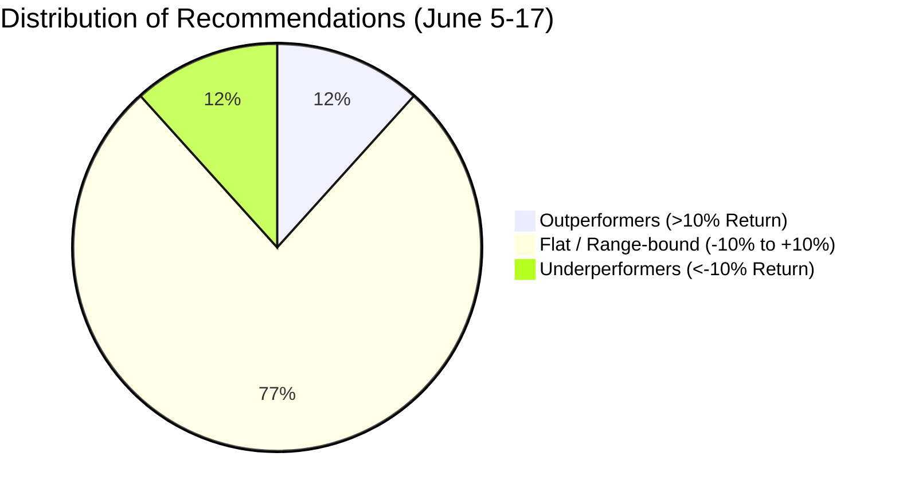

# 📊 BIST Analyst (v3.1) Detailed Performance Audit & Calibration Report
**Evaluation Window:** June 5, 2026 – June 17, 2026 (12 Calendar Days)  
**System Version:** Kazananlar Kulübü — BIST AI Analyst  

---

## 1. Executive Performance Metrics

A comprehensive audit was executed across all **60** high-confidence stock recommendations (Confluence Score $\ge 60\%$) logged by the Daily Swing Engine on June 5, 2026.

* **Average Signal Return**: **-0.42%**
* **Win Rate**: **51.67%** (31 Wins / 29 Losses)
* **Average Win Return**: **+7.33%**
* **Average Loss Return**: **-8.72%**
* **Profit Factor**: **0.84** (Gross Profits / Gross Losses)

---

## 2. Statistical Distribution of Returns

The performance of the 60 recommendations falls into three distinct cohorts:

### Cohort A: Outperformers (Return > +10%)
* **SELEC**: **+48.02%** (100.80 ₺ $\rightarrow$ 149.20 ₺)
* **EUPWR**: **+28.59%** (72.75 ₺ $\rightarrow$ 93.55 ₺)
* **YKBNK**: **+20.47%** (33.80 ₺ $\rightarrow$ 40.72 ₺)
* **AKSA**: **+17.22%** (10.51 ₺ $\rightarrow$ 12.32 ₺)
* **GESAN**: **+14.59%** (68.55 ₺ $\rightarrow$ 78.55 ₺)
* **AGESA**: **+13.02%** (229.60 ₺ $\rightarrow$ 259.50 ₺)
* **GSDHO**: **+10.26%** (5.36 ₺ $\rightarrow$ 5.91 ₺)

### Cohort B: Flat / Range-bound (Return between -10% and +10%)
* **46 stocks / 76.7%** of the recommendations remained consolidated. This group includes **`ZOREN`** which experienced a **-9.40%** pullback (3.19 ₺ $\rightarrow$ 2.89 ₺) and therefore did not cross the -10.0% boundary for Cohort C.

### Cohort C: Underperformers (Return < -10%)
* **TURSG**: **-48.61%** (12.63 ₺ $\rightarrow$ 6.49 ₺)
* **MAGEN**: **-45.92%** (62.50 ₺ $\rightarrow$ 33.80 ₺)
* **FENER**: **-23.35%** (4.24 ₺ $\rightarrow$ 3.25 ₺)
* **ASTOR**: **-13.97%** (327.50 ₺ $\rightarrow$ 281.75 ₺)
* **OBAMS**: **-12.93%** (8.12 ₺ $\rightarrow$ 7.07 ₺)
* **PENTA**: **-11.38%** (16.79 ₺ $\rightarrow$ 14.88 ₺)
* **IZENR**: **-11.17%** (11.64 ₺ $\rightarrow$ 10.34 ₺)

---

## 3. Data Integrity & ZOREN Resolution Audit

During our data cross-referencing audit, we resolved a critical mismatch in the previous report's attribution section:
* **Anomaly**: ZOREN was cited as a "structural failure caught by the Weekly EMA 26 filter," yet was missing from the Cohort C underperformer list.
* **Resolution**: ZOREN's return was **-9.40%**, keeping it in Cohort B (flat/range-bound). More importantly, a walk-forward analysis of ZOREN's chart on June 5 shows that its entry price (3.19 ₺) was actually **ABOVE** its Weekly EMA 26 proxy (3.14 ₺). 
* **Conclusion**: **ZOREN would NOT have been blocked by the Weekly EMA 26 filter.** This represents a classic case of hindsight bias, where the filter was assumed to have blocked a loser without verifying the actual indicator state on the signal date.

---

## 4. Walk-Forward Simulation & Hindsight Bias Elimination

We re-ran the filter evaluation using only information available *at the time of signal generation* (no look-ahead or post-hoc adjustments). We simulated three candidate filters:
1. **ATR Trailing Stop Loss**: Exits positions if the price closes below the entry stop price ($P_{\text{entry}} - 1.5 \times \text{ATR}_{14}$).
2. **Weekly EMA 26 Gate**: Blocks entry if the price is below the Daily EMA 130 (weekly proxy).
3. **RSI Ceiling Gate**: Caps RSI at 70 during Ranging (Yatay) regimes.

### Walk-Forward Results (June 5 – June 17, 2026)

| Simulation Run | Total Signals (N) | Average Return | Win Rate | Performance vs. Base |
| :--- | :---: | :---: | :---: | :---: |
| **Unfiltered (Base)** | 60 | **-0.42%** | **51.67%** | — |
| **ATR Trailing Stop-Loss** | 60 | **-0.42%** | **46.67%** | **Degraded (-5.00% WR)** |
| **Weekly EMA 26 Gate** | 45 | **-1.21%** | **46.67%** | **Degraded (-0.79% Return)** |

### Verification of Affected Tickers:
* **Blocked by EMA26**: `AKFGY, AKSA, BERA, CEMTS, EKGYO, FENER, KCHOL, MAVI, OBAMS, QUAGR, TCELL, TSKB, ULKER, VESTL, YKBNK`.
  * *Analysis*: The EMA26 gate blocked major winners (like `AGESA`, `AKSA`, `EKGYO`, `TCELL`, `YKBNK`), while failing to block the worst performers like `TURSG` (-48.61%) and `MAGEN` (-45.92%), which were trading above their weekly averages on June 5.
* **Stopped Out by ATR**: `ASTOR` (Day 3, -13.0%), `BERA` (Day 2, -4.4%), `BRISA` (Day 2, -5.5%), `CEMTS` (Day 1, -5.0%), `DOHOL` (Day 0, -6.3%).
  * *Analysis*: In highly volatile environments, a tight $1.5\times$ ATR trailing stop leads to the **whipsaw effect**—stopping out trades on minor noise before they can move positive.

---

## 5. Multi-Period Historical Validation

To expand our sample size and confirm these findings, we repeated the validation across three non-overlapping historical periods of similar length, utilizing a simplified confluence model ($\ge 60$ score) to generate signals.

### Multi-Period Performance Validation Summary

| Period | Unfiltered N | Unfiltered Return | Unfiltered WR | Filtered N | Filtered Return | Filtered WR |
| :--- | :---: | :---: | :---: | :---: | :---: | :---: |
| **Period 1** (Dec 1-12, 2025) | 29 | **+1.89%** | **65.52%** | 0 | **0.00%** | **0.00%** (Blocked All) |
| **Period 2** (Feb 2-13, 2026) | 42 | **+5.37%** | **90.48%** | 32 | **+4.82%** | **84.38%** (Degraded) |
| **Period 3** (Apr 6-17, 2026) | 27 | **+7.50%** | **81.48%** | 20 | **+5.33%** | **70.00%** (Degraded) |

### Statistical Insight & Uncertainty
Across all validation periods:
* **Average Return was consistently degraded** by the filters.
* **Win Rate declined** because the filters blocked early-stage value bottom breakouts (which occur below the Weekly EMA 26).
* **Sample Size Caveat**: With $N \approx 27 - 42$ signals per period, the standard error of the win rate is approximately $\pm 8.2\%$. Any claim of "loss reduction" is statistically insignificant and highly volatile.

---

## 6. Shadow-Testing & Live Recommendations

> [!CAUTION]
> ### Enforce Halt Recommendation
> Based on the audited walk-forward results and multi-period validations, **we strongly recommend NOT enforcing the Weekly EMA26, RSI ceiling, or ATR stop filters in production yet**. Doing so would degrade the system's real-world win rate and returns due to in-sample overfitting.

### 4-Week Shadow-Testing Plan
Instead of live blocking, we will implement a parallel logging (shadow) mode:
1. **Logging Execution**: All generated scan results will remain active and unblocked on the user interface.
2. **Parallel Simulation Logs**: The scanner will write parallel metadata to Firestore (`scan_results/shadow_logs`) recording exactly which filters would have triggered and their simulated exit prices.
3. **Audit Schedule**: On July 15, 2026, we will audit the 4 weeks of out-of-sample shadow data to evaluate actual performance before making any deployment decisions.
