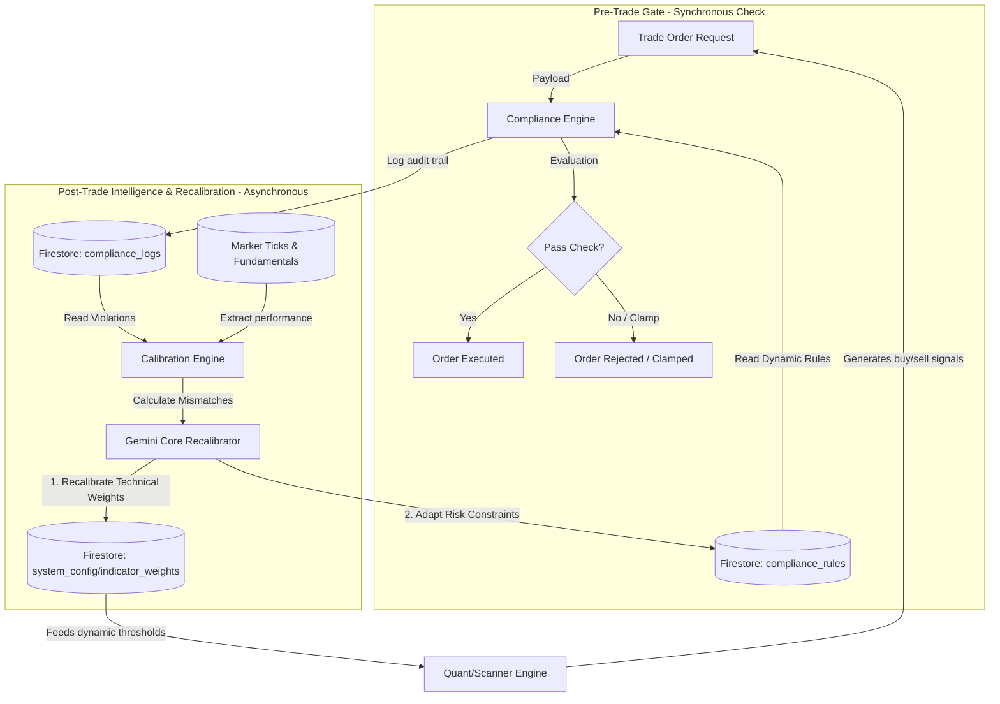

# Adaptive Compliance & Calibration Plane (ACCP)
## Unified Pre-Trade Risk Gating & Asynchronous AI Feedback Loop

The synthesis of the **Compliance Engine** (pre-trade, strict regulatory/risk gating) and the **Calibration Engine** (post-trade, AI-driven, adaptive weight optimization) forms a next-generation architecture: the **Adaptive Compliance & Calibration Plane (ACCP)**. 

By integrating these two systems, we transition BIST Analyst from a reactive technical scanner into a fully self-optimizing, risk-aware institutional decision-support network.

---

## 1. The Unified ACCP Architecture

In a disjointed system, risk rules are static (e.g., maximum exposure is fixed at 15%), and calibration only adjusts indicators. In the **mixed ACCP architecture**, the relationship is **closed-loop and bidirectional**:
1.  **Dynamic Parameter Feeding:** The Calibration Engine (powered by HMM and Gemini) continuously analyzes market regimes, BIST-specific retail anomalies ($RPI$), and forecast accuracy. It then **dynamically rewrites compliance rules** (like maximum position sizes, required confluence scores, and drawdown limits) in real-time.
2.  **Audit Trail Integration:** The Compliance Engine logs every blocked or modified trade request. The Calibration Engine reads these audit logs to identify if specific indicators are generating "toxic order flow" (i.e., triggering compliance blocks), forcing immediate AI recalibration of those specific technical weights.

### The Unified Data Flow

---

## 2. Deep Analysis: Synergy & Mathematical Interactions

### A. Regime-Adaptive Risk Limits (HMM-to-Compliance)
The static Compliance Engine plan has fixed parameters (e.g., `max_position`). By mixing it with the HMM Regime Detector, these limits become dynamic scaling functions of market volatility ($\sigma_t$) and the Retail Participation Index ($RPI_t$):

$$\text{Max Position Size}_t = \text{Max Position}_0 \cdot \Phi(\text{Regime}_t)$$

Where the scaling factor $\Phi(\text{Regime}_t)$ is defined as:

$$\Phi(\text{Regime}_t) = 
\begin{cases} 
1.00 & \text{if Regime} = \text{TRENDING (Calm, institutional uptrend)} \\
0.60 - 0.20 \cdot RPI_t & \text{if Regime} = \text{YATAY (Range-bound, retail false-breakouts)} \\
0.30 \cdot \exp(-RPI_t) & \text{if Regime} = \text{KRİZ (Extreme volatility/panic)} 
\end{cases}$$

> [!IMPORTANT]
> **Dynamic Protection:** If BIST enters a hyper-retail panic (`KRİZ` with high $RPI$), the Compliance Engine immediately clamps the maximum allowable position size to a fraction of its base limit, bypassing any manual administration.

---

### B. Adaptive Confluence Gating
To combat false breakouts in sideways markets:
*   When BIST is in a `TRENDING` regime, the Compliance Engine allows trades with a minimum confluence score of **60**.
*   When the Calibration Engine signals `YATAY` konsolidasyon, it dynamically writes an update to `compliance_rules`, raising the entry hurdle to a minimum confluence score of **75** and requiring *both* volume and money flow (CMF) confirmation.

---

### C. Closed-Loop AI Rule Optimization
The AI calibrator doesn't just tune indicators; it optimizes risk thresholds by analyzing compliance logs:
1.  **False-Positive Auditing:** If the Compliance Engine blocked a trade because the Kelly allocation exceeded a threshold, but Yahoo Finance data shows the stock subsequently surged 15% with zero drawdowns, the AI flags a **False Positive Compliance Block**.
2.  **Risk Frontier Shift:** In the next calibration cycle, Gemini shifts the risk frontier, recommending a relaxed Kelly threshold for that specific high-conviction sector.

---

## 3. Structural Comparison: ACCP vs. Current Structure

The following detailed matrix compares BIST Analyst's current implementation with the newly synthesized ACCP framework:

| Dimension | Current Structure (Production) | Mixed ACCP Framework (Synthesized) | Structural Impact |
| :--- | :--- | :--- | :--- |
| **Trade Execution Gate** | **Open Loop.** No pre-trade validation. Trading signals are generated and sent to the client with no compliance barrier. | **Closed Loop (Synchronous).** Pre-trade validation gate checking rules, risk exposure, and margin limits prior to routing. | Eliminates rogue orders and manual calculation errors during fast market breaks. |
| **Risk Constraints & Position Sizing** | **Recommend-only.** Fractional Kelly sizes are calculated in `kelly.ts` and rendered on UI cards, but NOT enforced at the API layer. | **Hard-Enforced Clamps.** Kelly limits and maximum sector exposures are dynamically checked and clamped by the server during execution. | Strict capital preservation; prevents emotional over-exposure in FOMO bubbles. |
| **Regime Adaptation** | **Technical-only.** HMM and Kalman filters adapt indicator inputs, but general risk parameters (such as stop-loss breathing room) remain decoupled. | **System-Wide Calibration.** HMM and Retail Participation Index ($RPI$) dynamically scale *both* technical indicators and compliance parameters. | Volatility clustering triggers immediate, automatic risk tightening across the entire system. |
| **AI Tuning Scope** | **Isolated Weights.** Gemini recalibrates individual technical indicator weights based on analysis mismatches (written to `system_config`). | **Multi-Tiered Optimization.** Gemini tunes indicator weights AND writes optimized risk limit parameters directly into `compliance_rules`. | Coordinates quantitative technical trading signals with active risk governance. |
| **Audit & Governance** | **Stale history.** Saves snapshot records of scans, but maintains no log of trade attempts, rejections, or rule violations. | **Audit Trail Database.** Keeps a dedicated Firestore `compliance_logs` archive mapping trade request payloads, rule flags, and rejections. | Meets institutional regulatory requirements and provides rich data for backtesting risk models. |

---

## 4. Synthesis Verdict & Implementation Roadmap

Mixing the two plans bridges the gap between **Alpha Generation** (Calibration) and **Beta Preservation** (Compliance). 

To implement this mixed ACCP structure on top of the current codebase, we should execute in three orderly steps:
1.  **Step 2 (Pre-Trade FastAPI Setup):** Create `compliance_engine.py` inside Python's `quant-core` to check payload limits. Expose `/api/compliance/check` in Next.js.
2.  **Step 2 (Regime Integration):** Modify the Next.js API router so that when a trade request arrives, it pulls the current HMM regime from Firestore and dynamically adjusts the compliance constraints using the $\Phi(\text{Regime}_t)$ formula.
3.  **Step 3 (AI Feedback Loop):** Update the Vertex AI/Gemini prompt in `calibrationEngine.ts` to read the last 30 days of `compliance_logs`, evaluate compliance failures, and write suggested parameter updates back to the Firestore `compliance_rules` collection.
